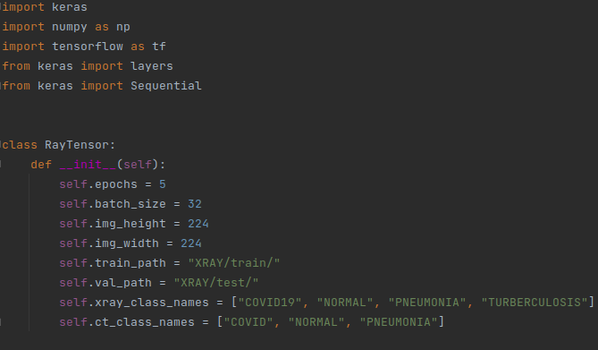
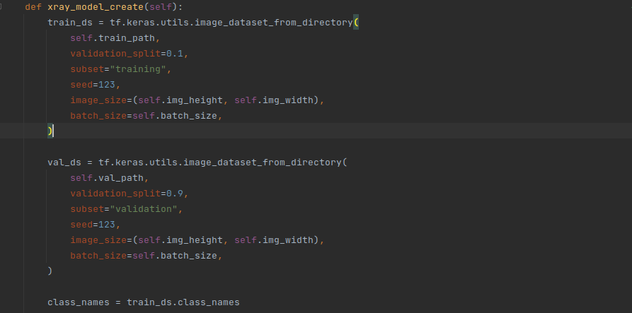
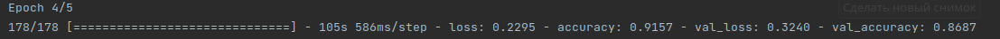
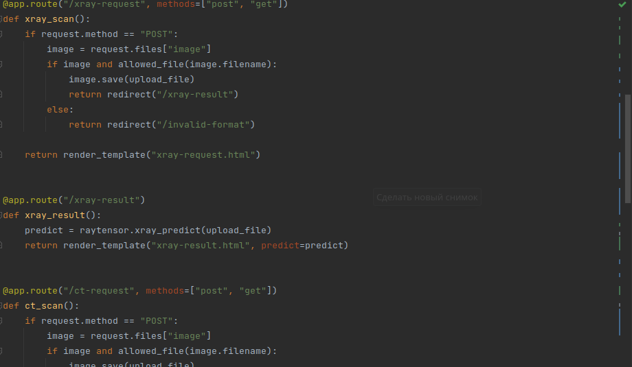
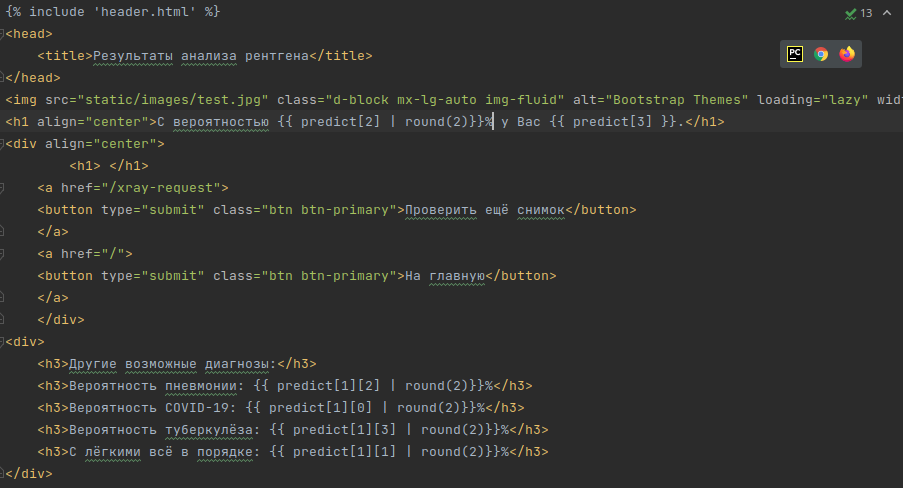
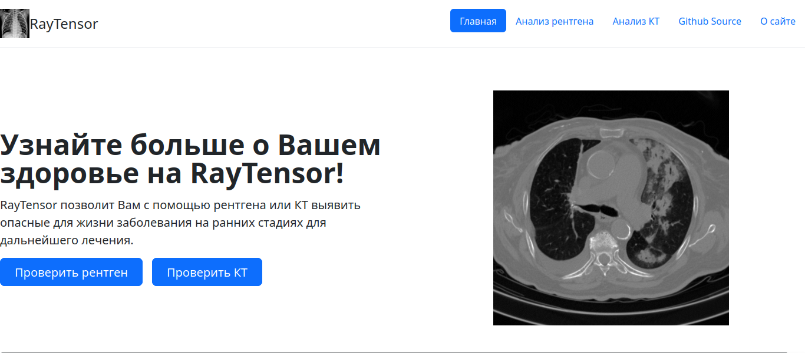
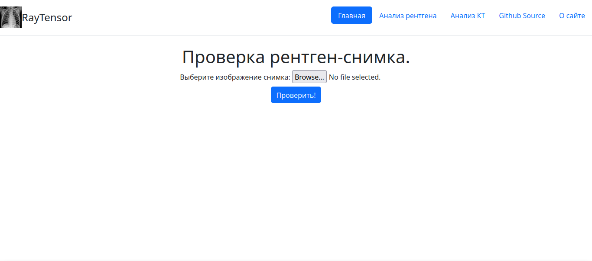
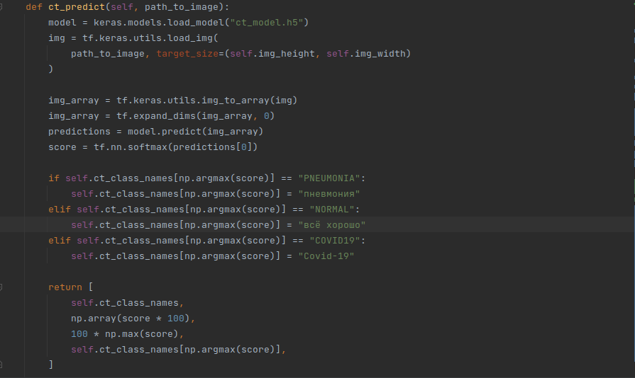
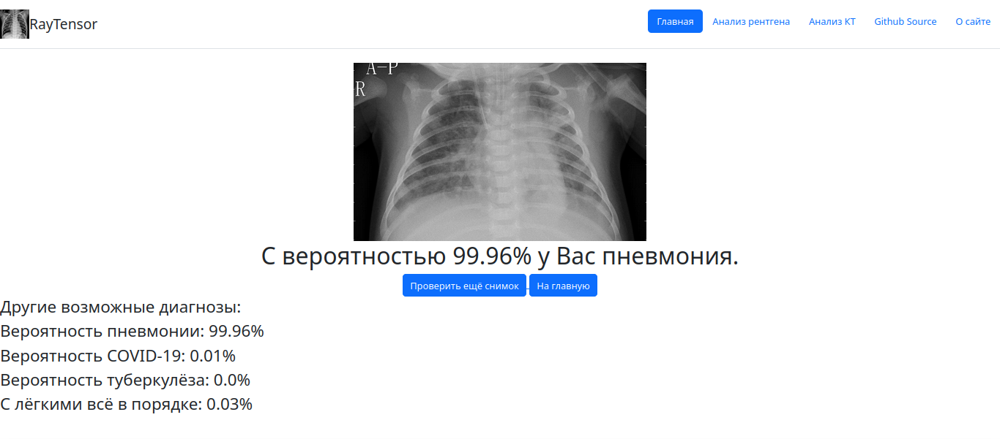

# Что это?

## RayTensor - веб-приложение для выявления и диагностики респираторных заболеваний любой стадии путём анализа КТ и/или рентгена.

# Как это работает?

## Tensorflow в связке с keras составляют основу приложения - нейронную сеть, определяющую 3 диагноза у рентген-снимков:
<ul>
<li><h3>1. Пневмония.</h3></li>
<li><h3>2. Covid-19 (SARS-CoV-2</h3></li>
<li><h3>3. Очаговый туберкулёз лёгких</h3></li>
</ul>

## 2 диагноза для КТ-снимков:
<ul>
<li><h3>1. Пневмония.</h3></li>
<li><h3>2. Covid-19 (SARS-CoV-2</h3></li>
</ul>

# Использование Tensorflow и keras для создания нейронной сети:

## Импорт библиотек и инициализация проекта:

## Создание тренировочного и валидационного датасета:

## Точность определения диагноза составляет более 90%!

## Вершину айсберга составляет веб-сервер, написанный на микрофреймворке Flask.

## Frontend основан на стандартном HTML5 с привязкой к стилям Bootstrap, а также на втроенном в Flask шаблонизаторе Junja, обеспечивающий высокую читаемость кода за счёт сокращения его количества.

# Использование

## При развёртывании сервера нас встречает минималистичная главная страница с основными гиперссылками. Кроме того, header может облегчить Вам быстрое перемещение по сайту.

## В зависимости от выбранного варианта, откроется щаблонизированная форма загрузки образца на сайт:

## После выбора файла форма передаст файл модели для дальнейшей предобработки и анализа:

## Долгожданный результат! На выходе сайт возвращает выгруженное Вами изображение, а также показывает поставленный диагноз и его вероятность.

